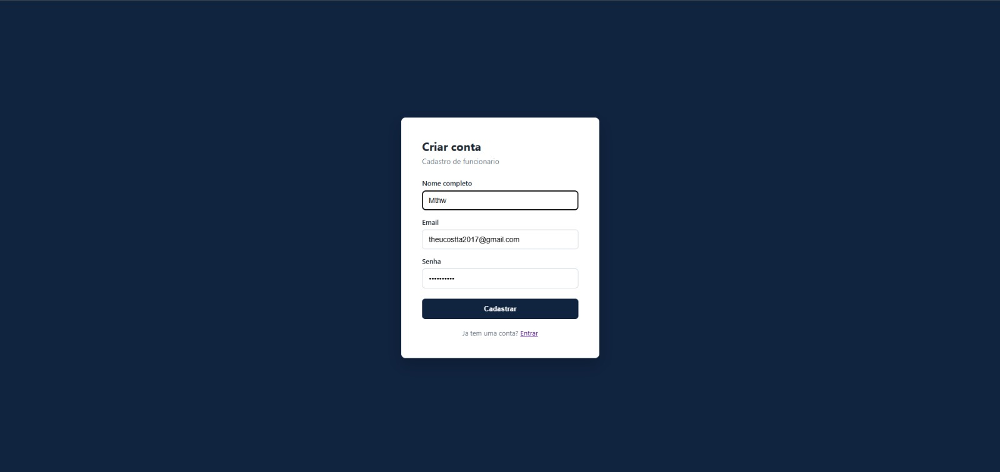
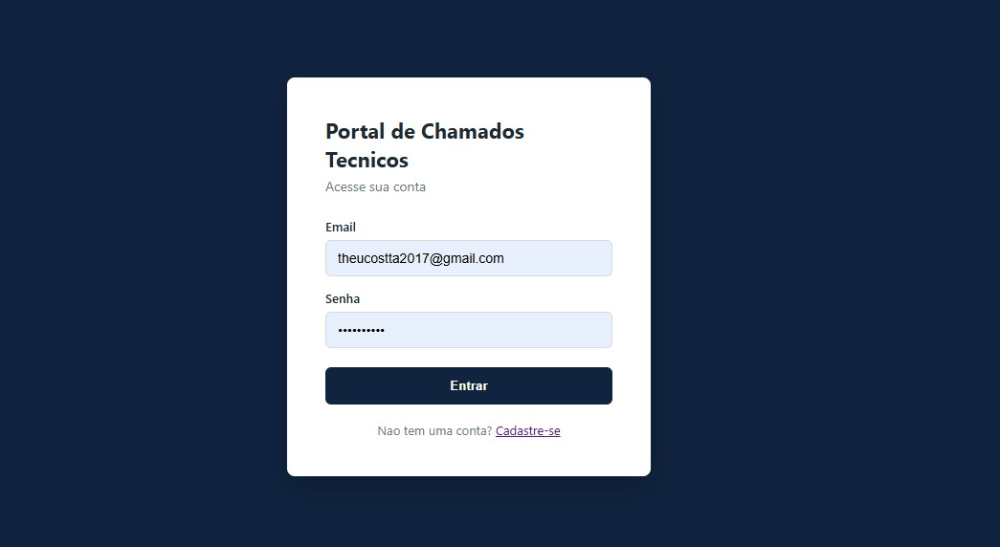
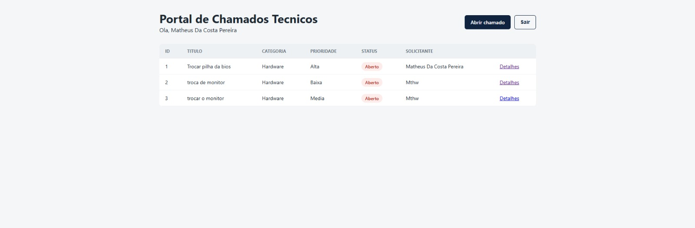
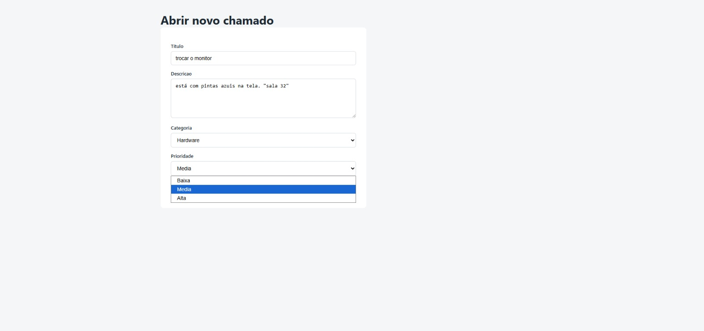
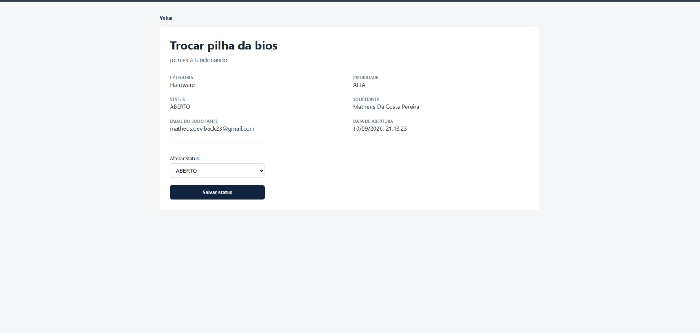

# OmniDesk

Sistema fullstack para abertura e acompanhamento de chamados tecnicos internos, com controle de acesso por perfil (funcionario e suporte).

Internal Technical Support Ticket Portal (Helpdesk). A fullstack system for opening and tracking internal technical support tickets, with role-based access control (employee and support staff).

## Stack utilizada / Stack used

**Backend:** Java 21, Spring Boot, Spring Security, JWT (jjwt), Spring Data JPA, PostgreSQL, Springdoc OpenAPI (Swagger UI).

**Frontend:** React (Vite), Axios, React Router.

**Infraestrutura:** Docker Compose (PostgreSQL).

## Funcionalidades / Features

- Cadastro e login de usuarios com senha criptografada (BCrypt).
- Autenticacao stateless via JWT.
- Dois perfis de acesso: `ROLE_USER` (funcionario) e `ROLE_ADMIN` (suporte).
- Abertura de chamados por qualquer usuario autenticado.
- Listagem de chamados: usuario comum ve apenas os proprios, administrador ve todos.
- Alteracao de status do chamado restrita ao perfil `ROLE_ADMIN`.
- Documentacao interativa da API via Swagger UI.
- Tratamento global de excecoes com respostas JSON estruturadas.
- Testes unitarios da camada de servico com JUnit 5 e Mockito.

## Por que escolher este projeto?

Este projeto foi desenhado para refletir praticas comuns em sistemas corporativos reais, e nao apenas um CRUD de exemplo. Os pontos abaixo justificam as escolhas tecnicas:

**Seguranca com JWT:** sistemas corporativos frequentemente precisam de autenticacao stateless, especialmente quando o backend atende multiplos clientes (web, mobile, integracoes). O uso de JSON Web Tokens elimina a necessidade de sessao no servidor, facilita a escalabilidade horizontal da API e e o padrao de mercado adotado por empresas que expoem APIs REST.

**RBAC (Role-Based Access Control):** em um ambiente de helpdesk real, nem todo usuario pode alterar o status de um chamado, apenas a equipe de suporte deve ter essa permissao. Implementar controle de acesso baseado em papeis (`ROLE_USER` e `ROLE_ADMIN`) demonstra entendimento de um requisito de negocio critico presente em praticamente todo sistema corporativo: nem todo usuario autenticado tem a mesma autoridade sobre os dados.

**Documentacao com Swagger:** em equipes de desenvolvimento, a API costuma ser consumida por outros times (frontend, mobile, QA, integracoes externas). Uma documentacao gerada automaticamente a partir do codigo, sempre atualizada e testavel diretamente pelo navegador, reduz atrito de comunicacao entre equipes e agiliza a integracao de novos desenvolvedores ao projeto.

Juntos, esses tres pilares (autenticacao, autorizacao e documentacao) sao exigencias praticamente universais em vagas de backend, o que torna este projeto um portfolio representativo do dia a dia de um desenvolvedor em ambiente corporativo.

## Screenshots do Projeto

Para adicionar as imagens do sistema em funcionamento, salve os arquivos dentro da pasta `docs/screenshots/` na raiz do projeto (crie a pasta se ela nao existir) e mantenha os nomes de arquivo sugeridos abaixo. As tags de imagem ja estao prontas: assim que o arquivo correspondente existir na pasta, a imagem aparece automaticamente ao visualizar este README no GitHub.

### Tela de login



### Tela de cadastro



### Dashboard de chamados



### Abertura de novo chamado



### Detalhe do chamado e alteracao de status (visao administrador)



## Estrutura do projeto / Project structure

```
helpdesk-portal/
  backend/
    src/main/java/com/helpdesk/
      model/
      repository/
      dto/
      security/
      exception/
      service/
      controller/
      config/
    src/test/java/com/helpdesk/service/
    pom.xml
  frontend/
    src/
      api/
      context/
      routes/
      pages/
  docker-compose.yml
  scaffold.sh
  README.md
```

## Como executar localmente / Running locally

### 1. Subir o banco de dados PostgreSQL

```bash
docker compose up -d
```

Isso ira criar um banco `helpdesk_db` exposto na porta `5433` do seu computador (mapeada para a porta interna `5432` do container), com usuario `helpdesk_user` e senha `helpdesk_pass`, conforme configurado em `backend/src/main/resources/application.properties`.

Se voce ja tiver outro PostgreSQL instalado nativamente no Windows ocupando a porta `5432`, a porta `5433` evita esse conflito. Caso queira usar a porta padrao `5432`, ajuste o mapeamento no `docker-compose.yml` e a URL `spring.datasource.url` no `application.properties` de volta para `5432`.

### 2. Executar o backend

```bash
cd backend
mvn spring-boot:run
```

A API sera iniciada em `http://localhost:8080`.

A documentacao Swagger UI estara disponivel em:

```
http://localhost:8080/swagger-ui.html
```

### 3. Executar os testes do backend

```bash
cd backend
mvn test
```

### 4. Executar o frontend

```bash
cd frontend
npm install
npm run dev
```

O frontend sera iniciado em `http://localhost:5173` e ja esta configurado para consumir a API em `http://localhost:8080` (variavel `VITE_API_URL`, ver `.env.example`).

## Preparando para deploy / Preparing for deployment

### Backend em Render ou Railway

1. Gere o artefato executavel do backend:
   ```bash
   cd backend
   mvn clean package -DskipTests
   ```
   Isso gera um arquivo `.jar` em `backend/target/`.

2. No Render ou Railway, crie um servico do tipo Web Service apontando para o repositorio, com:
   - Build command: `mvn clean package -DskipTests`
   - Start command: `java -jar target/helpdesk-backend-0.0.1-SNAPSHOT.jar`

3. Provisione um banco PostgreSQL gerenciado pela propria plataforma (ambos oferecem addon de PostgreSQL) e configure as seguintes variaveis de ambiente no servico do backend, sobrescrevendo o `application.properties`:
   - `SPRING_DATASOURCE_URL`
   - `SPRING_DATASOURCE_USERNAME`
   - `SPRING_DATASOURCE_PASSWORD`
   - `HELPDESK_JWT_SECRET`

4. Libere a origem do frontend publicado na configuracao de CORS (`SecurityConfig.java`), atualizando a lista de origens permitidas.

### Frontend em Render, Railway ou Vercel

1. Gere o build de producao:
   ```bash
   cd frontend
   npm run build
   ```
   Isso gera os arquivos estaticos em `frontend/dist/`.

2. Configure a variavel de ambiente `VITE_API_URL` apontando para a URL publica do backend implantado.

3. Publique a pasta `dist` como um site estatico na plataforma escolhida.

## Licenca / License

Projeto desenvolvido por Matheus Costa.
